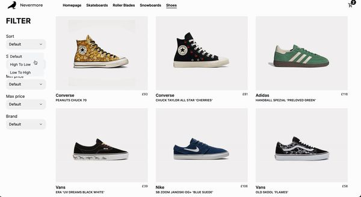

<h1>Portfolio Site</h1>
 E-commerce website, built with Next.js (leveraging SSR for SEO and speed), Tailwind CSS (for rapid UI development), TypeScript (for type safety), and PostgreSQL (for robust data management and scalability), offers a seamless user experience with Stripe integration for secure payments. Explore, contribute, and feel free to fork this project!

<h2>Desktop Front Page</h2>

<h2>Filtering Animation Made With Framer Motion</h2>

<h2>Shopping Cart</h2>

<h2>Checkout Page Made Using Headless Stripe</h2>

